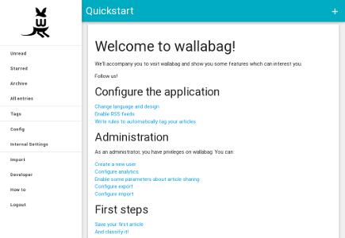

# wallabag
_application for saving web pages_

https://www.wallabag.org/

wallabag is a self hostable application for saving web pages. 
With this application you will not miss content anymore. Click, save, read it when you want. 
It saves the content you select so that you can read it when you have time. 

Default username is 'wallabag' and password is 'wallabag'.

